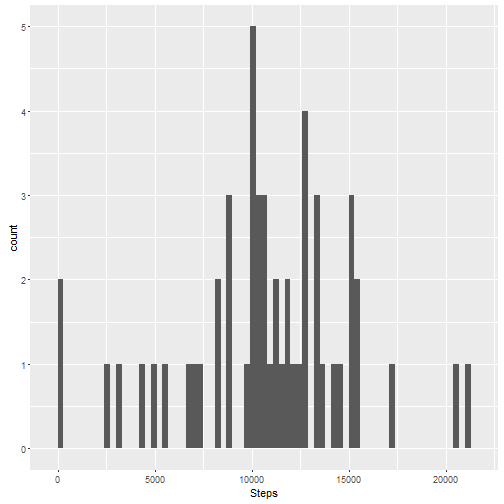
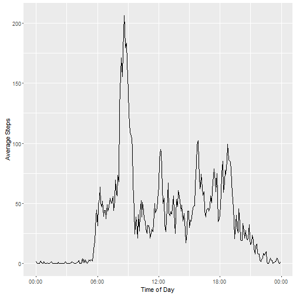
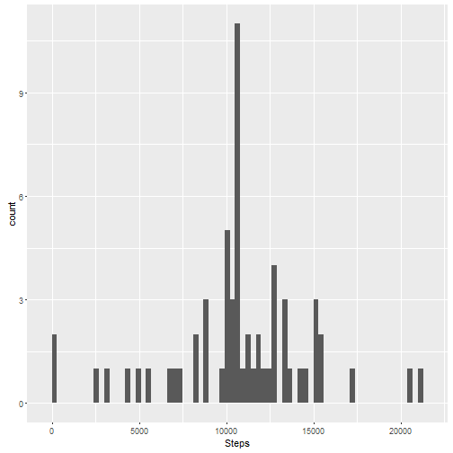
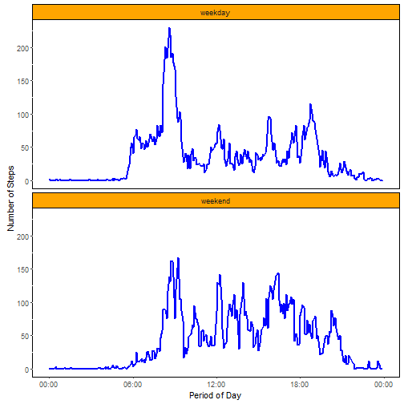

# Reproducible Research: Peer Assessment 1


For the purpose of the below script, dplyr and ggplot2 libraries are loaded with the following scripts:


```r
library(dplyr)
library(ggplot2)
library(scales)
```


## Loading and preprocessing the data

Raw Data is in a CSV format document named activity.csv and located in the working directory.

Below the code needed to load, label the columns and ensure the Date column has been loaded in the appropriate Date class:


```r
rawData <- read.csv("activity.csv", na.strings = "NA")
colnames(rawData) <- c("Steps","Date","Interval")
rawData$Date <- as.Date(rawData$Date)
```


## What is mean total number of steps taken per day?


#### 1 - Total number of steps per day

We first want to calculate the number of steps taken per day. To do so, we build a new table from our raw data, in which we group by Date, and sum the number of steps per each Date. Thanks to dplyr package, the below code is intuitive:


```r
stepsperday <- group_by(rawData, Date)
stepsperday <- summarize(stepsperday, Steps = sum(Steps))
```


#### 2 - Histogram 

We can now build the histogram of total number of steps taken per day. I personally do not find this practical, it is difficult to add additional items to the histogram such as a smoother, and depending on the binwidth, the normal distribution may be difficult to notice. Anyhow the below code is used:


```r
g <- ggplot(stepsperday, aes(Steps)) + geom_histogram( binwidth = 300)
print(g)
```




#### 3 - Mean and Median

For the mean, the following code gives us a mean of 10766 steps per day. Notice na.rm must be used in this case, since there are a few NA items.


```r
mean(stepsperday$Steps, na.rm = TRUE)
```

```
## [1] 10766.19
```

Similarily, for the median, we get 10765 which demonstrates the distribution is rather normally skewed.


```r
median(stepsperday$Steps, na.rm = TRUE)
```

```
## [1] 10765
```


## What is the average daily activity pattern?


#### 1 - Times series plot of average steps taken throughout the day

In a similar fashion to one of the previous questions, here we create a data frame of our data set grouped by time interval (notice also the processing of time column here), and then we calculate the mean number of Steps per Interval:


```r
stepsperinterval <- group_by(rawData, Interval)
stepsperinterval <- summarize(stepsperinterval, Steps = mean(Steps,na.rm=TRUE))

stepsperinterval_formatted <- mutate(stepsperinterval, Interval = sprintf("%04d",stepsperinterval$Interval))
stepsperinterval_formatted$Interval <- as.POSIXct(strptime(stepsperinterval_formatted$Interval, "%H%M"), "GMT")
```

The line type graphic built using ggplot:


```r
q <- ggplot(data = stepsperinterval_formatted, aes(Interval,Steps)) + geom_line() + xlab("Time of Day") + ylab("Average Steps") + scale_x_datetime(labels = date_format("%H:%M"))
print(q)
```




#### 2 - Peak period during the day

Here we simply capture the highest score of our stepsperinterval table, and we identify the matching interval:


```r
format(stepsperinterval_formatted$Interval[stepsperinterval_formatted$Steps==max(stepsperinterval_formatted$Steps)],"%H:%M")
```

```
## [1] "08:35"
```

The highest interval corresponds to an average of about 206 steps and is achieved at 08:35am. In fact, in the morning time, people tend to leave at regular time to work, whereas the returning time varies from day to day, which explains the highest score obtained during morning time.


## Imputing missing values


#### 1 - Number of NAs

We use the below simple formula to calculate number of NAs


```r
sum(is.na(rawData$Steps))
```

```
## [1] 2304
```

It is important to note that there are 288 5-minute intervals in a day. Therefore, 2304 / 288 = 8 days of missing data.


#### 2 - Filling missing values: Strategy

The strategy used here is the mean per 5-minute interval, which can be captured from stepsperinterval.


#### 3 - Filling missing values: New Data Set

NOTE: Instead of creating a new csv file, all I do is identify the subset of NA values, and merge the values of stepsperinterval data into it!


```r
rawData_completecases <- rawData[complete.cases(rawData),]

rawData_NAsubset <- subset(rawData, is.na(Steps))
rawData_NAsubset <- rawData_NAsubset[,c("Date","Interval")]
rawData_NAsubset2 <- merge(rawData_NAsubset,stepsperinterval)

rawData_NewDataSet <- rbind(rawData_completecases,rawData_NAsubset2)
```


#### 4 - Histogram, mean, median, and there interpretations

We now rebuild a histogram using same settings as previously:


```r
stepsperday_NewDataSet <- group_by(rawData_NewDataSet, Date)
stepsperday_NewDataSet <- summarize(stepsperday_NewDataSet, Steps = sum(Steps))
u <- ggplot(stepsperday_NewDataSet, aes(Steps)) + geom_histogram( binwidth = 300)
print(u)
```



Notice the peak increased by a count of 8, and the remainder of the histogram remains identical (besides the y-scale)

We calculate it's mean:


```r
mean(stepsperday_NewDataSet$Steps)
```

```
## [1] 10766.19
```

It is expected that the mean is in fact the same as previously computed with the data set that included NAs, since we filled the missing information with average values.

And finally it's median:


```r
median(stepsperday_NewDataSet$Steps)
```

```
## [1] 10766.19
```

Regarding the median, by adding 8 new days of data with an average of 10766 steps a day, when initially the distribution was only very slightly skewed without the NAs, we now have further reduced it's skewness and in our case here we obtain Median = Mean.

In fact, adding averages to a sample alter the normal distribution of a random variable.


## Are there differences in activity patterns between weekdays and weekends?

#### 1 - New factor variable


```r
rawData_NewDataSet$Weekdays <- as.POSIXlt(rawData_NewDataSet$Date)$wday
rawData_NewDataSet$Weekdays <- ifelse(rawData_NewDataSet$Weekdays=="0"|rawData_NewDataSet$Weekdays=="6", "weekend","weekday")
rawData_NewDataSet$Weekdays <- as.factor(rawData_NewDataSet$Weekdays)

stepsperinterval_NewDataSet <- group_by(rawData_NewDataSet, Interval, Weekdays)
stepsperinterval_NewDataSet <- summarize(stepsperinterval_NewDataSet, Steps = mean(Steps,na.rm=TRUE))
```

#### 2 - Plots


```r
stepsperinterval_NewDataSet$DateTime <- as.POSIXct(strptime(sprintf("%04d",stepsperinterval_NewDataSet$Interval), "%H%M"), "GMT")
v <- ggplot(stepsperinterval_NewDataSet, aes(DateTime,Steps)) + 
      geom_line(colour="blue", size = 1) + facet_wrap(~Weekdays, ncol=1) + 
      scale_x_datetime(labels = date_format("%H:%M")) +
      xlab("Period of Day") + 
      ylab("Number of Steps") + 
      theme(panel.background = element_rect(fill='white',colour='black'), strip.background = element_rect(fill='orange', colour='black'))
print(v)
```



Looking at the above plots, we can see that on week-ends there isn't as much activity in the early rush hours (no walking to go to work), and on the other side we can see there is more activity throughout the day.

